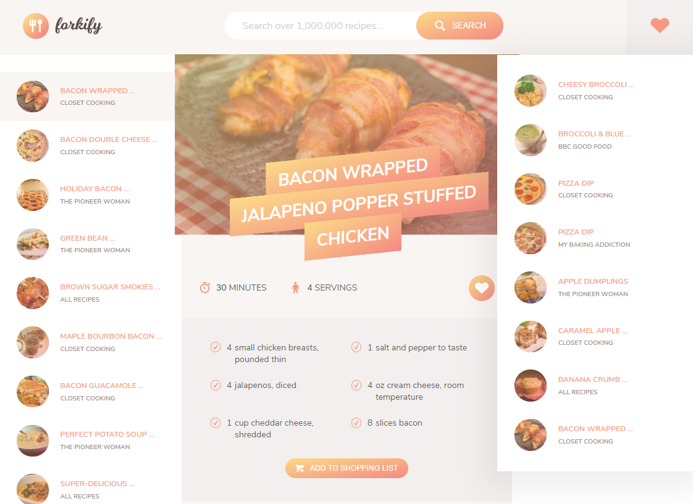
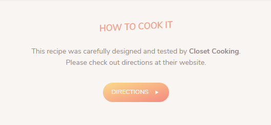

# Forkify-app

JavaScript app for searching recipes.

## Table of contents
* [General info](#general-info)
* [Technologies](#technologies)
* [Try out](#try-out)
* [How to use](#how-to-use)
* [API](#api)
* [Available search queries](#available-search-queries)
* [Sources](#sources)

## General info

The application allows the user to search recipes. The user can also create a shopping list based on the recipe.

## Technologies
* JavaScript 2015+
* Webpack

## Try out
https://mkarasinski.github.io/Forkify-app/

## How to use
* Search for recipes using search bar - available search queries are listed below

  

* Change servings and add ingredients to your shopping list

* Like recipe to save it for future 

* If you need extended explainations, go to How to cook it section

  

## API
App was based on food2fork API, which no longer works. The API was changed to http://forkify-api.herokuapp.com/ created by course teacher - Jonas Schmedtmann.

## Available search queries
* apple
* apricot
* arepas
* artichoke
* asparagus
* avocado
* bacon
* banana
* basil
* bbq
* bean
* beef
* beetroot
* blackberry
* blackcurrant
* blueberry
* boysenberry
* broccoli
* brussel sprouts
* bunny chow
* cabbage
* cake
* carrot
* cauliflower
* celery
* champ
* cherry
* chicken
* chickpea
* chili
* chili
* chips
* chocolate
* cinnamon
* coconut
* coriander
* corn
* crab
* croissant
* cucumber
* curry
* dill
* donuts
* duck
* fajitas
* fig
* fish
* fries
* garlic
* goat
* grape
* grapefruit
* green bean
* green pepper
* ham
* hamburger
* hummus
* ice cream
* kebab
* ketchup
* kiwifruit
* lamb
* lasagna
* leek
* lemon
* lentil
* lettuce
* lime
* lobster
* lychee
* mandarin
* mango
* maple syrup
* marzipan
* masala
* melon
* mushrooms
* nectarine
* onion
* orange
* oregano
* paella
* papaya
* parma ham
* parsley
* passion fruit
* pasta
* peach
* pear
* peas
* pepperoni
* pie
* pierogi
* pineapple
* pizza
* plum
* poke
* pomegranate
* popcorn
* pork
* potato
* poutine
* pudding
* pumpkin
* quince
* radish
* raspberry
* red pepper
* rendang
* ribs
* rosemary
* saffron
* salad
* salami
* sausage
* seafood
* som tam
* steak
* strawberry
* sushi
* sweet potato
* tacos
* toast
* tofu
* tomato
* turkey
* watermelon
* zucchini

## Sources
This app is based on JavaScript Tutorial by Jonas Schmedtmann on Udemy.  
https://www.udemy.com/course/the-complete-javascript-course/
